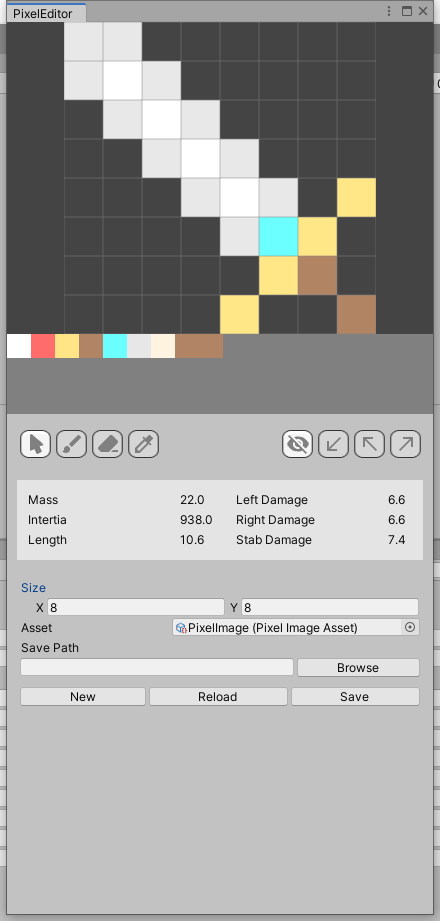

# Pixel Editor
用于 Unity Editor 开发环境下的像素图编辑器，目前支持像素武器绘制、武器数据和像素伤害衰减分析等。




## Usage

最上方深色区域为画布区，中间区域为像素素材调色板，下部为工具栏和参数编辑器区域。

### Canvas

画布网格尺寸可以在下方参数编辑区域修改，修改后需要点击 New 生成一张新画布。

### Palette

选中调色板中的任意元素即可进入绘图模式，此模式下点击画布上的网格可以绘制一个像素。

选中的调色板元素会显示一个十字标记。

### Tools

工具栏从左到右分别为

Tool | Description
-----|------------
<svg style="width:24px;height:24px" viewBox="0 0 24 24">    <path fill="currentColor" d="M13.64,21.97C13.14,22.21 12.54,22 12.31,21.5L10.13,16.76L7.62,18.78C7.45,18.92 7.24,19 7,19A1,1 0 0,1 6,18V3A1,1 0 0,1 7,2C7.24,2 7.47,2.09 7.64,2.23L7.65,2.22L19.14,11.86C19.57,12.22 19.62,12.85 19.27,13.27C19.12,13.45 18.91,13.57 18.7,13.61L15.54,14.23L17.74,18.96C18,19.46 17.76,20.05 17.26,20.28L13.64,21.97Z" /></svg> | 选择，选中一个画布像素或是调色板元素，在下方浅色面板中显示该选中像素的数据（未实现）
<svg style="width:24px;height:24px" viewBox="0 0 24 24">    <path fill="currentColor" d="M20.71,4.63L19.37,3.29C19,2.9 18.35,2.9 17.96,3.29L9,12.25L11.75,15L20.71,6.04C21.1,5.65 21.1,5 20.71,4.63M7,14A3,3 0 0,0 4,17C4,18.31 2.84,19 2,19C2.92,20.22 4.5,21 6,21A4,4 0 0,0 10,17A3,3 0 0,0 7,14Z" /></svg> | 绘图，使用当前调色板中选定的元素绘图。
<svg style="width:24px;height:24px" viewBox="0 0 24 24">    <path fill="currentColor" d="M15.14,3C14.63,3 14.12,3.2 13.73,3.59L2.59,14.73C1.81,15.5 1.81,16.77 2.59,17.56L5.03,20H12.69L21.41,11.27C22.2,10.5 22.2,9.23 21.41,8.44L16.56,3.59C16.17,3.2 15.65,3 15.14,3M17,18L15,20H22V18" /></svg> | 擦除，该模式下点击画布上的像素将对应位置擦除为 null。
<svg style="width:24px;height:24px" viewBox="0 0 24 24">    <path fill="currentColor" d="M6.92,19L5,17.08L13.06,9L15,10.94M20.71,5.63L18.37,3.29C18,2.9 17.35,2.9 16.96,3.29L13.84,6.41L11.91,4.5L10.5,5.91L11.92,7.33L3,16.25V21H7.75L16.67,12.08L18.09,13.5L19.5,12.09L17.58,10.17L20.7,7.05C21.1,6.65 21.1,6 20.71,5.63Z" /></svg> | 取色器，该模式下点击画布上的像素，会选中调色板中对应的元素。

### Debug Layer

选择显示的分析覆盖层，从左到右分别是：

 Tool | Description
 -----|------------
 <svg style="width:24px;height:24px" viewBox="0 0 24 24">    <path fill="currentColor" d="M11.83,9L15,12.16C15,12.11 15,12.05 15,12A3,3 0 0,0 12,9C11.94,9 11.89,9 11.83,9M7.53,9.8L9.08,11.35C9.03,11.56 9,11.77 9,12A3,3 0 0,0 12,15C12.22,15 12.44,14.97 12.65,14.92L14.2,16.47C13.53,16.8 12.79,17 12,17A5,5 0 0,1 7,12C7,11.21 7.2,10.47 7.53,9.8M2,4.27L4.28,6.55L4.73,7C3.08,8.3 1.78,10 1,12C2.73,16.39 7,19.5 12,19.5C13.55,19.5 15.03,19.2 16.38,18.66L16.81,19.08L19.73,22L21,20.73L3.27,3M12,7A5,5 0 0,1 17,12C17,12.64 16.87,13.26 16.64,13.82L19.57,16.75C21.07,15.5 22.27,13.86 23,12C21.27,7.61 17,4.5 12,4.5C10.6,4.5 9.26,4.75 8,5.2L10.17,7.35C10.74,7.13 11.35,7 12,7Z" /></svg> | 无覆盖层
 <svg style="width:24px;height:24px" viewBox="0 0 24 24">    <path fill="currentColor" d="M19,6.41L17.59,5L7,15.59V9H5V19H15V17H8.41L19,6.41Z" /></svg> | 显示向左挥砍的武器伤害衰减分布
<svg style="width:24px;height:24px" viewBox="0 0 24 24">    <path fill="currentColor" d="M19,17.59L17.59,19L7,8.41V15H5V5H15V7H8.41L19,17.59Z" /></svg> | 显示向前突刺的武器伤害衰减分布
<svg style="width:24px;height:24px" viewBox="0 0 24 24">    <path fill="currentColor" d="M5,17.59L15.59,7H9V5H19V15H17V8.41L6.41,19L5,17.59Z" /></svg> | 显示向右挥砍的武器伤害衰减分布

在启用伤害衰减分布的覆盖层时，下方会出现参数面板，其中参数 `p`, `k`, `y`, `e` 每个武器攻击类型（左右挥砍/突刺）相互独立，影响像素衰减的分布区域。另外的 `Threshold` 为4个衰减等级的阈值，全局有效。

目前修改这些参数无法保存，需要同步硬编码写入到代码 `Assets/Script/Pixel/PixelWeaponAnalyser.cs` 中。


### Property Panel

属性面板显示武器当前的属性，包括：

Property | Description
---------|------------
Mass | 武器重量，为每个像素的 `weight` 求和
Inertia | 以右下角为轴的转动惯量，以每个像素为计算单位，`I = Σ mr²`，其中 `m` 为像素重量，`r` 为像素到右下角转轴的距离
Length | 武器的总长度
Left Damage | 向左挥砍的伤害系数，为单个像素的伤害值×衰减值
Right Damage | 向右挥砍的伤害系数
Stab Damage | 突刺的伤害系数


武器伤害衰减系数的计算在 `Assets/Script/Pixel/PixelWeaponAnalyser.cs` 中的
```csharp
WeaponPixelData GenerateWeaponData(int x, int y, float distance, float damageAttenuation)
```


### Misc

尺寸属性仅在点击 `New` 创建新画布时才生效

`Asset` 属性框中显示当前编辑的 `PixelImageAsset`，可以将已有的 Asset 文件拖到这里并点击 `Reload` 来加载一个图像

`Save Path` 选择该 Asset 的保存位置，可以将当前编辑的图像（未保存过的新画布）保存到指定的位置，可以点击 `Browse` 打开一个文件浏览器

`New` 按钮点击将创建一个新的画布，应用画布尺寸，并且创建一个新的 `PixelImageAsset`，并且会重置武器伤害分析器。

`Reload` 按钮点击后会将画布重置为 `Asset` 框内指向的 `PixelImageAsset` 中的图像。

`Save` 按钮点击后会将当前画布应用到 `Asset` 框内的 `PixelImageAsset`，并且保存到指定的路径。